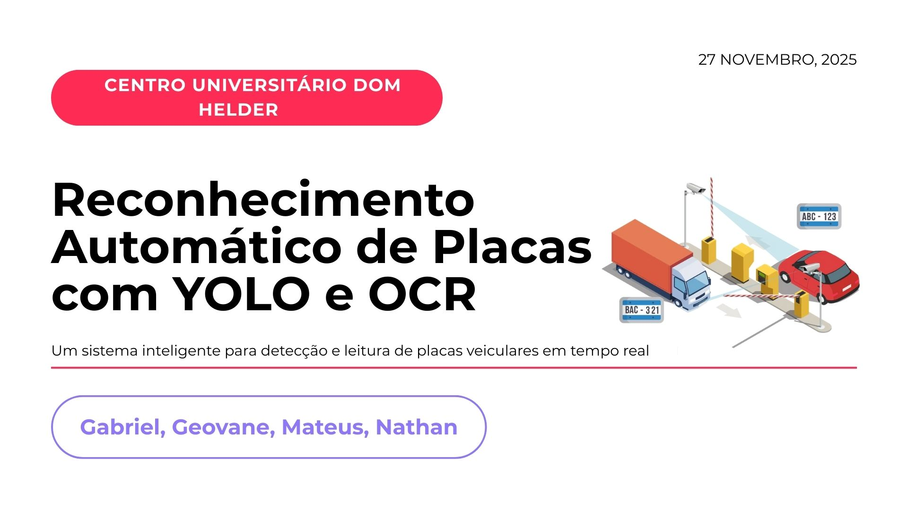
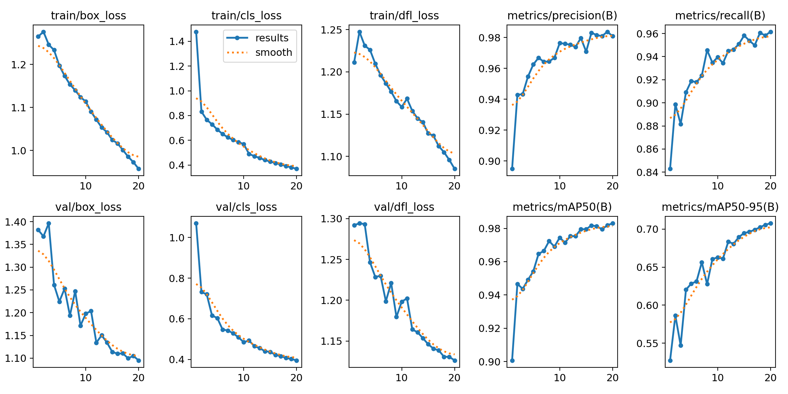
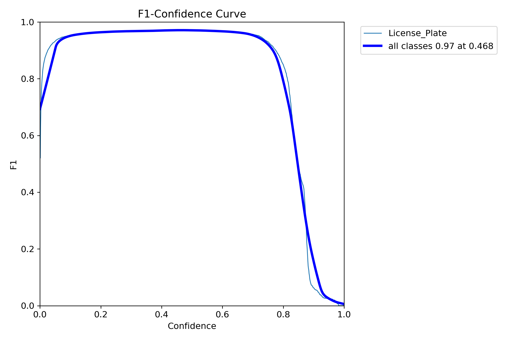
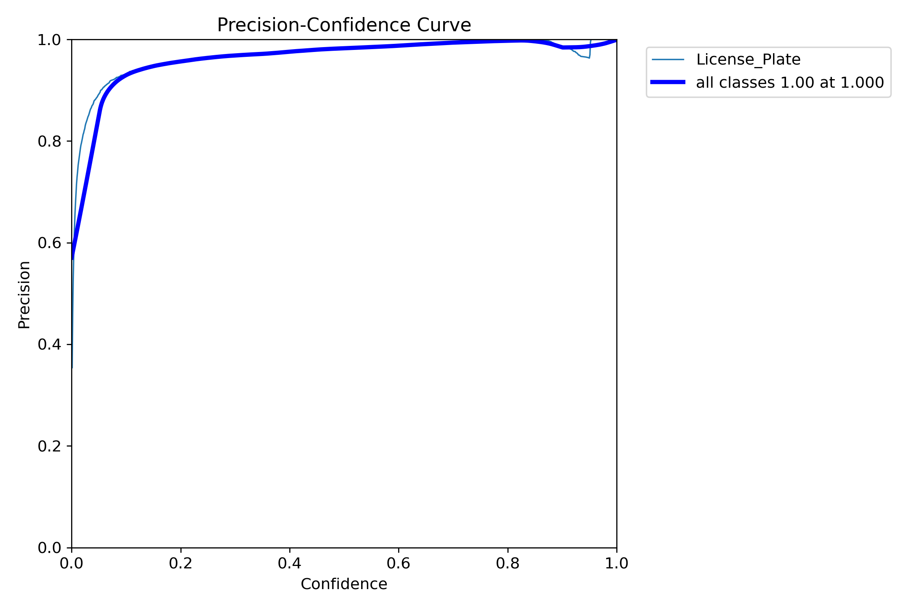
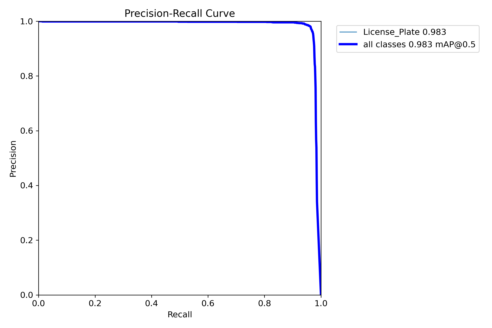
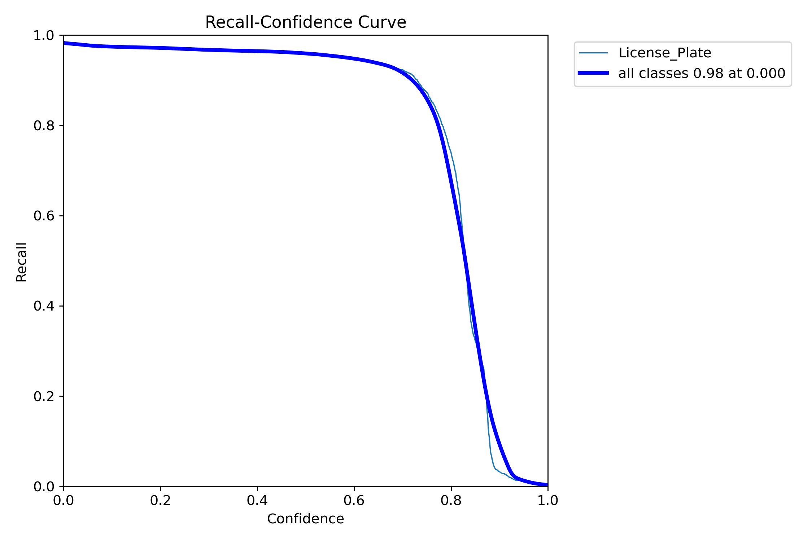

# Reconhecimento Automático de Placas Veiculares (ALPR) com YOLOv11 e OCR

> **Disciplina:** Processamento de Imagens Digitais (PID)
> 
> **Professor:** Fischer Stephan Meira
>
> **Instituição:** Centro Universitário Dom Helder

Este projeto implementa um pipeline completo de detecção, rastreamento e reconhecimento de placas de veículos em vídeos. O sistema utiliza **YOLOv11** para detecção de objetos, o algoritmo **SORT** para rastreamento (tracking), **EasyOCR** para leitura de caracteres e diversas técnicas de **Processamento Digital de Imagens** para pré-processamento.




## 📋 Sobre o Projeto

O objetivo deste trabalho é demonstrar a aplicação prática de visão computacional e processamento de imagens para monitoramento de tráfego. O sistema é capaz de detectar veículos, manter o rastreamento de IDs únicos, localizar a placa, aplicar filtros de melhoria de imagem e realizar a leitura dos caracteres com correção heurística.

### Pipeline de Processamento
O fluxo de dados segue as seguintes etapas:
1.  **Detecção Veicular:** O modelo YOLOv11 identifica veículos (carros, motos, caminhões, ônibus) no frame.
2.  **Rastreamento (Tracking):** O algoritmo SORT atribui e mantém um ID único para cada veículo ao longo do tempo.
3.  **Detecção de Placa:** Uma segunda rede YOLO, treinada especificamente, recorta a região da placa.
4.  **Pré-processamento (PID):** Aplicação de filtros (Upscaling, Bilateral, Sharpening, Otsu) para preparar a imagem para o OCR.
5.  **OCR e Heurística:** Leitura via EasyOCR e correção de caracteres baseada em regras de posição (ex: corrigir 'O' para '0' em posições numéricas).
6.  **Interpolação:** Suavização dos dados para preencher lacunas em frames onde a detecção falhou momentaneamente.

---

## 🛠️ Tecnologias Utilizadas

* **Python 3.8+**
* **YOLOv11 (Ultralytics):** Estado da arte em detecção de objetos.
* **OpenCV:** Manipulação e processamento de imagens (filtros, transformações).
* **EasyOCR:** Reconhecimento óptico de caracteres.
* **SORT:** Algoritmo de rastreamento (*Simple Online and Realtime Tracking*).
* **Pandas/NumPy:** Manipulação de dados e álgebra linear.

---

## 🚀 Instalação e Configuração

Siga os passos abaixo para rodar o projeto localmente.

### 1. Clonar o Repositório

```bash
git clone https://github.com/NathanMarques2001/plate-detection.git
cd plate-detection
```

## 2. Criar um Ambiente Virtual (Recomendado)

```bash
# Windows
python -m venv venv
.\venv\Scripts\activate
```

```bash
# Linux/Mac
python3 -m venv venv
source venv/bin/activate
```

---

## 3. Instalar Dependências

As bibliotecas necessárias estão listadas no arquivo `requirements.txt`.

```bash
pip install -r requirements.txt
```

---

## 💻 Como Executar

O projeto possui dois modos principais de execução:

### 1. Pipeline Completo (Vídeo)

Este script processa o vídeo de entrada, detecta os veículos, realiza o OCR, interpola os dados e gera o vídeo final com as visualizações.
Bash

```bash
python main.py
```

O fluxo de execução será: `Detecção -> Interpolação -> Geração de Vídeo (media/video-final.mp4)`.

### 2. Análise Acadêmica (Filtros PID - Canny/Harris)

Para demonstrar a aplicação dos filtros estudados na disciplina (requisito acadêmico), execute o script de análise. Ele processa um frame estático e salva as etapas intermediárias na pasta ```academic_results/```.

```bash
python analyze_images.py
```

Este script gera as seguintes saídas visuais:

- Upscaling (Interpolação Cúbica)
- Escala de Cinza
- Filtro Bilateral
- Canny Edge Detection (Detecção de bordas)
- Harris Corner Detection (Detecção de quinas)
- Otsu Thresholding (Binarização)

---

## 🔬 Detalhes do Processamento de Imagens (PID)

Conforme exigido na disciplina, aplicamos diversas técnicas para garantir a precisão do sistema. Abaixo, a explicação de cada filtro utilizado no código (`preprocess.py` e `analyze_images.py`):

| Etapa | Técnica | Descrição |
| :--- | :--- | :--- |
| **1. Upscaling** | Interpolação Cúbica | Aumenta a resolução da placa (3x) para facilitar a detecção de bordas e caracteres pequenos. |
| **2. Denoising** | Filtro Bilateral | Remove ruídos da imagem preservando as bordas das letras, sendo superior ao Gaussian Blur para fins de OCR. |
| **3. Realce** | Sharpening (Kernel) | Aplica uma convolução para aumentar a nitidez e o contraste entre a letra e o fundo da placa. |
| **4. Análise** | Canny & Harris | Utilizados no script de análise (`analyze_images.py`) para estudo estrutural e identificação de pontos de interesse na placa. |
| **5. Binarização** | Otsu Threshold | Converte a imagem para preto e branco automaticamente, calculando o limiar ideal baseado no histograma da imagem. |

---

## 🧠 Treinamento do Modelo

O modelo de detecção de placas foi treinado utilizando o **YOLOv11 Nano** via Google Colab, aproveitando a aceleração de GPU (Tesla T4).

* **Notebook de Treino:** Disponível em [`models/train/main.ipynb`](models/train/main.ipynb).
* **Dataset:** *License Plate Recognition v4* (Augmented 3x).
* **Configurações:**
    * Épocas: 20
    * Batch Size: 32
    * Otimizador: AdamW (lr=0.002)
    * Resolução de entrada: 640x640

Para reproduzir o treinamento, basta abrir o notebook no Colab e conectar ao seu Google Drive contendo o dataset.

---

## 📊 Resultados e Métricas

Os resultados obtidos após 20 épocas de treinamento demonstraram alta eficácia na detecção da classe "License Plate".

### Métricas Finais (Validação)

| Métrica | Valor | Significado |
| :--- | :--- | :--- |
| **mAP50** | **98.3%** | Precisão média considerando sobreposição (IoU) de 50%. |
| **mAP50-95** | **70.7%** | Precisão média rigorosa variando IoU de 50% a 95%. |
| **Precision** | **98.1%** | Taxa de acerto quando o modelo diz que é uma placa. |
| **Recall** | **96.1%** | Capacidade do modelo de encontrar todas as placas presentes. |

> *Dados extraídos dos logs de treinamento salvos em `models/train/results`.*

### Curvas de Aprendizado e Performance

Abaixo, os gráficos gerados durante o processo de validação do modelo:

#### Visão Geral do Treinamento


#### Curvas de Precisão e Recall





O sistema implementa ainda uma **correção heurística** no pós-processamento (arquivo `src/util.py`) para corrigir erros de OCR baseados na confusão visual (ex: ler `I` como `1` em posições numéricas), garantindo que a leitura final seja compatível com o padrão de placas veiculares.

### Frame do vídeo com o pipeline aplicado


---

## 👥 Autores

Trabalho desenvolvido pelos alunos:
- [Gabriel Dietze](https://github.com/GabrielDietze)
- [Geovane Soares](https://github.com/GeovaneR)
- [Mateus Augustus](https://github.com/Mamn11)
- [Nathan Marques](https://github.com/NathanMarques2001)

---

## 📄 Licença

Este projeto é de uso acadêmico para avaliação na disciplina de Processamento de Imagens Digitais.
